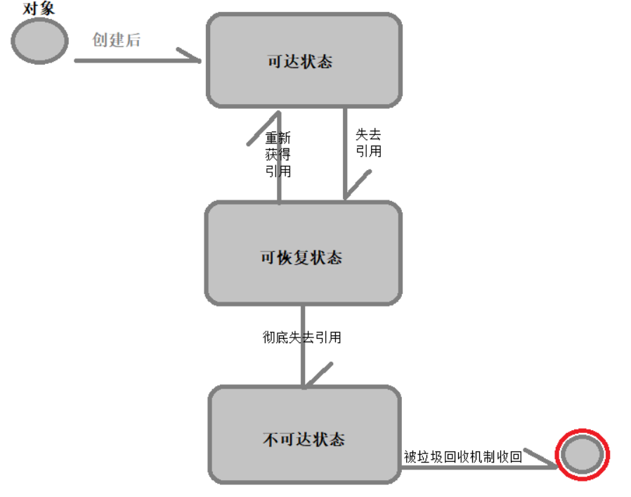

# java第六套面试题

## Spring中@Autowired的实现原理是什么？

@Autowired这个注解我们经常在使用，现在，我想问的是，它的作用到底是什么呢?

首先，我们从所属范围来看，事实上这个注解是属于spring的容器配置的一个注解，与它同属容器配置的注解还有：@Required,@Primary, @Qualifier等等。因此@Autowired注解是一个用于容器(container)配置的注解。

其次，我们可以直接从字面意思来看，@autowired注解来源于英文单词autowire,这个单词的意思是自动装配的意思。自动装配又是什么意思？这个词语本来的意思是指的一些工业上的用机器代替人口，自动将一些需要完成的组装任务，或者别的一些任务完成。而在spring的世界当中，自动装配指的就是使用将Spring容器中的bean自动的和我们需要这个bean的类组装在一起。

因此，个人对这个注解的作用下的定义就是:将Spring容器中的bean自动的和我们需要这个bean的类组装在一起协同使用。

# Bean的默认作用范围是什么？其他的作用范围？

在Spring中使用Scope来表示一个bean定义对应产生实例的类型，也可以说是对应实例的作用范围。Spring内置支持的scope严格来说默认是有五种，分别是：

1.singleton：这是默认Scope，表示在整个bean容器中或者说是整个应用中只会有一个实例。

2.prototype：多例类型(原型设计模式)，表示每次从bean容器中都会获取到一个对应bean定义全新的实例。

3.request：仅适用于Web环境下的ApplicationContext，表示每一个HttpRequest生命周期内会有一个单独的实例，即每一个Http请求都会拥有一个单独的实例。

4.session：仅适用于Web环境下的ApplicationContext，表示每一个HttpSession生命周期内会有一个单独的实例，即每一个HttpSession下都会拥有一个单独的实例，即每一个用户都将拥有一个单独的实例。

5.globalSession：仅适用于Web环境下的ApplicationContext，一般来说是Portlet环境下。表示每一个全局的Http Session下都会拥有一个单独的实例。


# 索引是什么概念?有什么作用？

数据库索引是帮助数据库高效获取数据的数据结构,本质上来说,索引就是数据结构.

可以简单的理解为排好序的快速查找的数据结构.在数据之外,数据库系统还维护着满足特定查找算法的数据结构,

这些数据结构以某种方式引用数据,这样就可以在这些数据结构上实现高级算法.这种数据结构,被称为索引.

一般来说索引本身也很大,不可能全部存在于内存之中,因此索引往往以索引文件的形式存储在磁盘上.

我们平时所说的索引,如果没有特殊指明,都是指B+树(多路搜索树,并不一定是二叉树).其中聚集索引,次要索引,复合索引,前缀索引,唯一索引都是使用B+树索引,统称索引.当然,除了B+树这种类型的索引之外,还有哈希索引等.


索引的目的在于提高查询效率.,可以类比字典.提高了数据检索的效率,降低了数据库的io成本.

降低了数据库的排序成本,降低了CPU的消耗.


# MySQL里主要有哪些索引结构？哈希索引和B+树索引比较？

MYSQL中的索引主要分为三种:

1.单值索引

单值索引是最通用,也是最简单的一种索引.一个索引只能包含一个列,一个表中可以有多个单值索引,索引值可以重复.

2.唯一索引

与单值索引有些类似,但不同之处在于索引值不能相同,但可以为null.我们声明unique关键字的时候,会为其字段自动添加唯一索引.

3.复合索引

最常用的索引,也是最实用的索引.是索引中最强大的一个.

复合索引能同时覆盖多个列,,对于复合索引来说:

mysql从左到右的使用索引中的字段,一个查询可以只使用索引的一部分,但是只能从最左侧开始.

例如:
我们定义了复合索引 index(c1,c2,c3),则我们进行查找的时候可以 c1 , c2 ,c3 | c1 ,c2 | c1 这三种组合来查找,只能

从最左边来开始,如果使用c2 , c3 进行查找则索引会失效.当最左侧字段是常量引用时,索引就十分有效.


<font style='font-weight:800'>哈希索引和B+树索引比较</font>

**B+树是一个平衡的多叉树，从根节点到每个叶子节点的高度差值不超过1，而且同层级的节点间有指针相互链接。**

在B+树上的常规检索，从根节点到叶子节点的搜索效率基本相当，不会出现大幅波动，而且基于索引的顺序扫描

时，也可以利用双向指针快速左右移动，效率非常高。

因此，B+树索引被广泛应用于数据库、文件系统等场景。顺便说一下，xfs文件系统比ext3/ext4效率高很多的原因

之一就是，它的文件及目录索引结构全部采用B+树索引，而ext3/ext4的文件目录结构则采用Linked list, hashed

 B-tree、Extents/Bitmap等索引数据结构，因此在高I/O压力下，其IOPS能力不如xfs。

**哈希索引就是采用一定的哈希算法，把键值换算成新的哈希值，检索时不需要类似B+树那样从根节点到叶子节点逐级查找，只需一次哈希算法即可立刻定位到相应的位置，速度非常快。**

B+树索引和哈希索引的明显区别是：

- **如果是等值查询，那么哈希索引明显有绝对优势**，因为只需要经过一次算法即可找到相应的键值；当然了，这个前提是，键值都是唯一的。如果键值不是唯一的，就需要先找到该键所在位置，然后再根据链表往后扫描，直到找到相应的数据；
- 从示意图中也能看到，**如果是范围查询检索，这时候哈希索引就毫无用武之地了**，因为原先是有序的键值，经过哈希算法后，有可能变成不连续的了，就没办法再利用索引完成范围查询检索；
- 同理，**哈希索引也没办法利用索引完成排序**，以及like ‘xxx%’ 这样的部分模糊查询（这种部分模糊查询，其实本质上也是范围查询）；
- **哈希索引也不支持多列联合索引的最左匹配规则**；
- B+树索引的关键字检索效率比较平均，不像B树那样波动幅度大，**在有大量重复键值情况下，哈希索引的效率也是极低的，因为存在所谓的哈希碰撞问题**。


# 说说Java线程池的原理？线程池有哪些？线程池工厂有哪些线程池类型，及其线程池参数是什么？

**线程池工作原理:**

​	**为什么要用线程池？**

诸如 Web 服务器、数据库服务器、文件服务器或邮件服务器之类的许多服务器应用程序都面向处理来自某些远程来源的大量短小的任务。请求以某种方式到达服务器，这种方式可能是通过网络协议（例如 HTTP、FTP 或 POP）、通过 JMS 队列或者可能通过轮询数据库。不管请求如何到达，服务器应用程序中经常出现的情况是：单个任务处理的时间很短而请求的数目却是巨大的。

构建服务器应用程序的一个过于简单的模型应该是：每当一个请求到达就创建一个新线程，然后在新线程中为请求服务。实际上，对于原型开发这种方法工作得很好，但如果试图部署以这种方式运行的服务器应用程序，那么这种方法的严重不足就很明显。每个请求对应一个线程（thread-per-request）方法的不足之一是：为每个请求创建一个新线程的开销很大；为每个请求创建新线程的服务器在创建和销毁线程上花费的时间和消耗的系统资源要比花在处理实际的用户请求的时间和资源更多。

除了创建和销毁线程的开销之外，活动的线程也消耗系统资源。在一个 JVM 里创建太多的线程可能会导致系统由于过度消耗内存而用完内存或“切换过度”。为了防止资源不足，服务器应用程序需要一些办法来限制任何给定时刻处理的请求数目。

线程池为线程生命周期开销问题和资源不足问题提供了解决方案。通过对多个任务重用线程，线程创建的开销被分摊到了多个任务上。其好处是，因为在请求到达时线程已经存在，所以无意中也消除了线程创建所带来的延迟。这样，就可以立即为请求服务，使应用程序响应更快。而且，通过适当地调整线程池中的线程数目，也就是当请求的数目超过某个阈值时，就强制其它任何新到的请求一直等待，直到获得一个线程来处理为止，从而可以防止资源不足。

​	**线程池的替代方案**

线程池远不是服务器应用程序内使用多线程的唯一方法。如同上面所提到的，有时，为每个新任务生成一个新线程是十分明智的。然而，如果任务创建过于频繁而任务的平均处理时间过短，那么为每个任务生成一个新线程将会导致性能问题。

另一个常见的线程模型是为某一类型的任务分配一个后台线程与任务队列。AWT 和 Swing 就使用这个模型，在这个模型中有一个 GUI 事件线程，导致用户界面发生变化的所有工作都必须在该线程中执行。然而，由于只有一个 AWT 线程，因此要在 AWT 线程中执行任务可能要花费相当长时间才能完成，这是不可取的。因此，Swing 应用程序经常需要额外的工作线程，用于运行时间很长的、同 UI 有关的任务。

每个任务对应一个线程方法和单个后台线程（single-background-thread）方法在某些情形下都工作得非常理想。每个任务一个线程方法在只有少量运行时间很长的任务时工作得十分好。而只要调度可预见性不是很重要，则单个后台线程方法就工作得十分好，如低优先级后台任务就是这种情况。然而，大多数服务器应用程序都是面向处理大量的短期任务或子任务，因此往往希望具有一种能够以低开销有效地处理这些任务的机制以及一些资源管理和定时可预见性的措施。线程池提供了这些优点。

​	**工作队列**

就线程池的实际实现方式而言，术语“线程池”有些使人误解，因为线程池“明显的”实现在大多数情形下并不一定产生我们希望的结果。术语“线程池”先于 Java 平台出现，因此它可能是较少面向对象方法的产物。然而，该术语仍继续广泛应用着。

虽然我们可以轻易地实现一个线程池类，其中客户机类等待一个可用线程、将任务传递给该线程以便执行、然后在任务完成时将线程归还给池，但这种方法却存在几个潜在的负面影响。例如在池为空时，会发生什么呢？试图向池线程传递任务的调用者都会发现池为空，在调用者等待一个可用的池线程时，它的线程将阻塞。我们之所以要使用后台线程的原因之一常常是为了防止正在提交的线程被阻塞。完全堵住调用者，如在线程池的“明显的”实现的情况，可以杜绝我们试图解决的问题的发生。

我们通常想要的是同一组固定的工作线程相结合的工作队列，它使用 wait() 和 notify() 来通知等待线程新的工作已经到达了。该工作队列通常被实现成具有相关监视器对象的某种链表。清单 1 显示了简单的合用工作队列的示例。尽管 Thread API 没有对使用 Runnable 接口强加特殊要求，但使用 Runnable 对象队列的这种模式是调度程序和工作队列的公共约定。


**JDK自带线程池总类介绍介绍：** 

​    1、newFixedThreadPool创建一个指定工作线程数量的线程池。每当提交一个任务就创建一个工作线程，如果工作线程数量达到线程池初始的最大数，则将提交的任务存入到池队列中。 

​    2、newCachedThreadPool创建一个可缓存的线程池。这种类型的线程池特点是： 
​    1).工作线程的创建数量几乎没有限制(其实也有限制的,数目为Interger. MAX_VALUE), 这样可灵活的往线程池中添加线程。 
​    2).如果长时间没有往线程池中提交任务，即如果工作线程空闲了指定的时间(默认为1分钟)，则该工作线程将自动终止。终止后，如果你又提交了新的任务，则线程池重新创建一个工作线程。 

​    3、newSingleThreadExecutor创建一个单线程化的Executor，即只创建唯一的工作者线程来执行任务，如果这个线程异常结束，会有另一个取代它，保证顺序执行(我觉得这点是它的特色)。单工作线程最大的特点是可保证顺序地执行各个任务，并且在任意给定的时间不会有多个线程是活动的 。 

​    4、newScheduleThreadPool创建一个定长的线程池，而且支持定时的以及周期性的任务执行，类似于Timer。(这种线程池原理暂还没完全了解透彻) 

​    总结： 一.FixedThreadPool是一个典型且优秀的线程池，它具有线程池提高程序效率和节省创建线程时所耗的开销的优点。但是，在线程池空闲时，即线程池中没有可运行任务时，它不会释放工作线程，还会占用一定的系统资源。 

​        二．CachedThreadPool的特点就是在线程池空闲时，即线程池中没有可运行任务时，它会释放工作线程，从而释放工作线程所占用的资源。但是，但当出现新任务时，又要创建一新的工作线程，又要一定的系统开销。并且，在使用CachedThreadPool时，一定要注意控制任务的数量，否则，由于大量线程同时运行，很有会造成系统瘫痪。   

**java线程池参数**

corePollSize：核心线程数。

maximumPoolSize：最大线程数。

keepAliveTime：空闲的线程保留的时间。

TimeUnit：空闲线程的保留时间单位。

BlockingQueue<Runnable>：阻塞队列，存储等待执行的任务。

ThreadFactory：线程工厂，用来创建线程。

RejectedExecutionHandler：队列已满，而且任务量大于最大线程的异常处理策略。


# hashmap原理，处理哈希冲突用的哪种方法？

HashMap 采用一种所谓的“Hash [算法](http://lib.csdn.net/base/datastructure)”来决定每个元素的存储位置。当程序执行 map.put(String,Obect)方法 时，系统将调用String的 hashCode() 方法得到其 hashCode 值——每个 Java 对象都有 hashCode() 方法，都可通过该方法获得它的 hashCode 值。得到这个对象的 hashCode 值之后，系统会根据该 hashCode 值来决定该元素的存储位置。源码如下:

````java
   public V put(K key, V value) {  
        if (key == null)  
            return putForNullKey(value);  
        int hash = hash(key.hashCode());  
        int i = indexFor(hash, table.length);  
        for (Entry<K,V> e = table[i]; e != null; e = e.next) {  
            Object k;  
            //判断当前确定的索引位置是否存在相同hashcode和相同key的元素，如果存在相同的hashcode和相同的key的元素，那么新值覆盖原来的旧值，并返回旧值。  
            //如果存在相同的hashcode，那么他们确定的索引位置就相同，这时判断他们的key是否相同，如果不相同，这时就是产生了hash冲突。  
            //Hash冲突后，那么HashMap的单个bucket里存储的不是一个 Entry，而是一个 Entry 链。  
            //系统只能必须按顺序遍历每个 Entry，直到找到想搜索的 Entry 为止——如果恰好要搜索的 Entry 位于该 Entry 链的最末端（该 Entry 是最早放入该 bucket 中），  
            //那系统必须循环到最后才能找到该元素。  
            if (e.hash == hash && ((k = e.key) == key || key.equals(k))) {  
                V oldValue = e.value;  
                e.value = value;  
                return oldValue;  
            }  
        }  
        modCount++;  
        addEntry(hash, key, value, i);  
        return null;  
    }  
   
````

​    上面程序中用到了一个重要的内部接口：Map.Entry，每个 Map.Entry 其实就是一个 key-value 对。从上面程序中可以看出：当系统决定存储 HashMap 中的 key-value 对时，完全没有考虑 Entry 中的 value，仅仅只是根据 key 来计算并决定每个 Entry 的存储位置。这也说明了前面的结论：我们完全可以把 Map 集合中的 value 当成 key 的附属，当系统决定了 key 的存储位置之后，value 随之保存在那里即可.HashMap程序经过我改造，我故意的构造出了hash冲突现象，因为HashMap的初始大小16,但是我在hashmap里面放了超过16个元素，并且我屏蔽了它的resize()方法。不让它去扩容。这时HashMap的底层数组Entry[]   table结构如下: 

   ````java
void addEntry(int hash, K key, V value, int bucketIndex) {  
    Entry<K,V> e = table[bucketIndex];  
    table[bucketIndex] = new Entry<K,V>(hash, key, value, e);  
    if (size++ >= threshold)  
        resize(2 * table.length);  
bsp;  
   ````


 上面方法的代码很简单，但其中包含了一个设计：系统总是将新添加的 Entry 对象放入 table 数组的 bucketIndex 索引处——如果 bucketIndex 索引处已经有了一个 Entry 对象，那新添加的 Entry 对象指向原有的 Entry 对象（产生一个 Entry 链），如果 bucketIndex 索引处没有 Entry 对象，也就是上面程序代码的 e 变量是 null，也就是新放入的 Entry 对象指向 null，也就是没有产生 Entry 链。

​       HashMap里面没有出现hash冲突时，没有形成单链表时，hashmap查找元素很快,get()方法能够直接定位到元素，但是出现单链表后，单个bucket 里存储的不是一个 Entry，而是一个 Entry 链，系统只能必须按顺序遍历每个 Entry，直到找到想搜索的 Entry 为止——如果恰好要搜索的 Entry 位于该 Entry 链的最末端（该 Entry 是最早放入该 bucket 中），那系统必须循环到最后才能找到该元素。

​       当创建 HashMap 时，有一个默认的负载因子（load factor），其默认值为 0.75，这是时间和空间成本上一种折衷：增大负载因子可以减少 Hash 表（就是那个 Entry 数组）所占用的内存空间，但会增加查询数据的时间开销，而查询是最频繁的的操作（HashMap 的 get() 与 put() 方法都要用到查询）；减小负载因子会提高数据查询的性能，但会增加 Hash 表所占用的内存空间。


**HashMap概述**

　HashMap基于哈希表的 Map 接口的实现。此实现提供所有可选的映射操作，并允许使用 null 值和 null 键。（除了不同步和允许使用 null 之外，HashMap 类与 Hashtable 大致相同。）此类不保证映射的顺序，特别是它不保证该顺序恒久不变。

　　值得注意的是HashMap不是线程安全的，如果想要线程安全的HashMap，可以通过Collections类的静态方法synchronizedMap获得线程安全的HashMap。

````java
 Map map = Collections.synchronizedMap(new HashMap());
````


**HashMap的数据结构**

　HashMap的底层主要是基于数组和链表来实现的，它之所以有相当快的查询速度主要是因为它是通过计算散列码来决定存储的位置。HashMap中主要是通过key的hashCode来计算hash值的，只要hashCode相同，计算出来的hash值就一样。如果存储的对象太多了，就有可能不同的对象所算出来的hash值是相同的，这就出现了所谓的hash冲突。学过数据结构的同学都知道，解决hash冲突的方法有很多，HashMap底层是通过链表来解决hash冲突的。

​       Hashmap里面的bucket出现了单链表的形式，散列表要解决的一个问题就是散列值的冲突问题，通常是两种方法：链表法和开放地址法。链表法就是将相同hash值的对象组织成一个链表放在hash值对应的槽位；开放地址法是通过一个探测算法，当某个槽位已经被占据的情况下继续查找下一个可以使用的槽位。java.util.HashMap采用的链表法的方式，链表是单向链表。


**冲突处理**

冲突处理主要分两种，一种是开放定址法，另一种是链地址法。HashMap的实现中采用的是链地址法。

开放定址法有两种处理方式，一种是线性探测另一种是平方探测。

线性探测：依次探测冲突位置的下一个位置。如，在哈希表的位置2处发生了冲突，则探测位置3处是否被使用了，若被使用了，则探测位置4……直至下一个被探测的位置为空（意味着还有位置可以插入元素---插入成功）或者探测了N-1（N为哈希表的长度）个元素又回到了原始的冲突位置处（意味着已经没有位置可供新元素插入了---插入失败）

因此，插入一个元素时，最坏情况下的时间复杂度为O（N），因为它有可能探测了N-1个元素！

平方探测：以平方大小来递增下一次待探测的位置。如，在哈希表位置2处发生了冲突，则探测 (1^2=1)位置3（2+1），若位置3被使用了，则探测（2^2=4） 位置6（2+4），若位置6被使用了，则探测（3^2=9）位置11（2+9=11）……**平方探测法有一个特点：对于任何一个给定的素数N（假设哈希表的长度设置为素数），当计算( h(k) + i ^2 ) MOD N 时，随着 i 的增长，得到的结果是循环的。**

因此，当平方探测重复探测了某一个位置时，说明探测失败即已经没有位置可供新元素插入了，尽管此时哈希表并没有满。

平方探测是跳着探测的，它忽略了一些位置，而这些位置可能是空的。即在哈希表仍未满的情况下，已经不能再插入新元素了

最坏情况下，平方探测需要检测 N/2个位置，因此插入一个元素的最坏时间复杂度为O（N）。


链地址法

在HashMap的实现中，采用的链地址法来解决冲突，**它有一个桶的概念:对于Entry数组而言，数组的每个元素处存储的是链表，而不是直接的Value。在链表中的每个元素才是真正的<Key, Value>。而一个链表，就是一个桶！因此HashMap最多可以有Entry.length 个桶。**


# BIO、NIO、AIO的区别和联系？

BIO
Java BIO即Block I/O ， 同步并阻塞的IO。

BIO就是传统的java.io包下面的代码实现。

NIO
什么是NIO? NIO 与原来的 I/O 有同样的作用和目的, 他们之间最重要的区别是数据打包和传输的方式。原来的 I/O 以流的方式处理数据，而 NIO 以块的方式处理数据。

面向流 的 I/O 系统一次一个字节地处理数据。一个输入流产生一个字节的数据，一个输出流消费一个字节的数据。为流式数据创建过滤器非常容易。链接几个过滤器，以便每个过滤器只负责单个复杂处理机制的一部分，这样也是相对简单的。不利的一面是，面向流的 I/O 通常相当慢。

一个 面向块 的 I/O 系统以块的形式处理数据。每一个操作都在一步中产生或者消费一个数据块。按块处理数据比按(流式的)字节处理数据要快得多。但是面向块的 I/O 缺少一些面向流的 I/O 所具有的优雅性和简单性。

AIO
Java AIO即Async非阻塞，是异步非阻塞的IO。


BIO （Blocking I/O）：同步阻塞I/O模式，数据的读取写入必须阻塞在一个线程内等待其完成。这里假设一个烧开水的场景，有一排水壶在烧开水，BIO的工作模式就是， 叫一个线程停留在一个水壶那，直到这个水壶烧开，才去处理下一个水壶。但是实际上线程在等待水壶烧开的时间段什么都没有做。

NIO （New I/O）：同时支持阻塞与非阻塞模式，但这里我们以其同步非阻塞I/O模式来说明，那么什么叫做同步非阻塞？如果还拿烧开水来说，NIO的做法是叫一个线程不断的轮询每个水壶的状态，看看是否有水壶的状态发生了改变，从而进行下一步的操作。

AIO （ Asynchronous I/O）：异步非阻塞I/O模型。异步非阻塞与同步非阻塞的区别在哪里？异步非阻塞无需一个线程去轮询所有IO操作的状态改变，在相应的状态改变后，系统会通知对应的线程来处理。对应到烧开水中就是，为每个水壶上面装了一个开关，水烧开之后，水壶会自动通知我水烧开了。


# jvm内存模型jmm 知道的全讲讲？

**什么是 Java 内存模型(JMM-共享内存模型)**

内存模型描述了程序中各个变量（实例域、静态域和数组元素）之间的关系，以及在实际计算机系统中将变量存储到内存和从内存中取出变量这样的底层细节。（共享变量是存放在堆内存中，对于局部变量等不会在线程之间共享）

Java内存模型定义了多线程之间共享变量的可见性以及如何在需要的时候对共享变量进行同步。原始的Java内存模型效率并不是很理想，因此Java1.5版本对其进行了重构，现在的Java8仍沿用了Java1.5的版本。
Java 线程之间的通信由 Java 内存模型控制，JMM 决定一个线程对共享变量的写入何时对另一个线程可见。

1、JMM是一种抽象的概念并不真实存在，它描述的是一组规则或规范，通过这组规范定义了程序中各个变量的访问方式。

2、JMM关于同步的规定：

线程解锁前，必须把共享变量的值刷新回主内存

线程加锁前，必须读取主内存的最新值到自己的工作内存

加锁解锁是同一把锁

由于JVM运行程序的实体是线程，而每个线程创建时JVM都会为其创建一个工作内存，工作内存是每个线程的私有数据区域，而Java内存模型中规定所有变量都存储在主内存，主内存是共享内存区域，所有线程都可以访问，但线程对变量的操作（读取赋值等）必须在自己的工作内存中进行，各个线程首先要将变量从主内存拷贝到自己的工作内存空间，然后对变量进行操作，操作完成后再将变量写回主内存，各个线程不能直接操作主内存中的变量，各个线程中的工作内存存储着主内存中的变量副本拷贝，因此不同的线程间无法访问对方的工作内存，线程间的通信必须依靠主内存来完成。

3、JMM对线程安全性的规范：

满足可见性、原子性、有序性这三个规范，才能保证线程安全

线程安全性获得保证：

       工作内存与主内存同步延迟现象导致的可见性问题，可以使用synchronized或volatile关键字解决，他们都可以使一个  线程修改后的变量立即对其他线程可见。
    
       对于指令重排导致的可见性问题和有序性问题，可以使用volatile关键字解决，因为volatile的另一个作用就是禁止指令 重排。


# 讲讲Java GC机制？

GC机制的基本算法是：分代收集，这个不用赘述。下面阐述每个分代的收集方法。

　　**年轻代：**

　在新生代中，使用“停止-复制”算法进行清理，将新生代内存分为2部分，1部分 Eden区较大，1部分Survivor比较小，并被划分为两个等量的部分。每次进行清理时，将Eden区和一个Survivor中仍然存活的对象拷贝到 另一个Survivor中，然后清理掉Eden和刚才的Survivor。

　　这里也可以发现，停止复制算法中，用来复制的两部分并不总是相等的（传统的停止复制算法两部分内存相等，但新生代中使用1个大的Eden区和2个小的Survivor区来避免这个问题）

　　由于绝大部分的对象都是短命的，甚至存活不到Survivor中，所以，Eden区与Survivor的比例较大，HotSpot默认是 8:1，即分别占新生代的80%，10%，10%。如果一次回收中，Survivor+Eden中存活下来的内存超过了10%，则需要将一部分对象分配到 老年代。用-XX:SurvivorRatio参数来配置Eden区域Survivor区的容量比值，默认是8，代表Eden：Survivor1：Survivor2=8:1:1.

　　**老年代：**

　　老年代存储的对象比年轻代多得多，而且不乏大对象，对老年代进行内存清理时，如果使用停止-复制算法，则相当低效。一般，老年代用的算法是标记-整理算法，即：标记出仍然存活的对象（存在引用的），将所有存活的对象向一端移动，以保证内存的连续。

​     在发生Minor GC时，虚拟机会检查每次晋升进入老年代的大小是否大于老年代的剩余空间大小，如果大于，则直接触发一次Full GC，否则，就查看是否设 置了-XX:+HandlePromotionFailure（允许担保失败），如果允许，则只会进行MinorGC，此时可以容忍内存分配失败；如果不 允许，则仍然进行Full GC（这代表着如果设置-XX:+Handle PromotionFailure，则触发MinorGC就会同时触发Full GC，哪怕老年代还有很多内存，所以，最好不要这样做）。

　　**方法区（永久代）：**

　　永久代的回收有两种：常量池中的常量，无用的类信息，常量的回收很简单，没有引用了就可以被回收。对于无用的类进行回收，必须保证3点：

1. 类的所有实例都已经被回收
2. 加载类的ClassLoader已经被回收
3. 类对象的Class对象没有被引用（即没有通过反射引用该类的地方）

​     永久代的回收并不是必须的，可以通过参数来设置是否对类进行回收。HotSpot提供-Xnoclassgc进行控制

​     使用-verbose，-XX:+TraceClassLoading、-XX:+TraceClassUnLoading可以查看类加载和卸载信息

​     -verbose、-XX:+TraceClassLoading可以在Product版HotSpot中使用；

​     -XX:+TraceClassUnLoading需要fastdebug版HotSpot支持


# Java怎么进行垃圾回收的？什么对象会进老年代？

Java怎么进行垃圾回收的？

java的垃圾回收机制是java语言的重要功能之一。当程序创建对象，数组等引用类型的实体时，Java就在堆中为其分配一块内存区，对象就保存在这块区域中，当这块内存不再被任何引用变量引用时，这块内存就变成了垃圾，等待垃圾回收机制进行回收。

垃圾回收机制具有以下等特征：

​	-> 垃圾回收机制只会回收堆内存中的垃圾,不会回收任何的物理资源(例如数据库的连接,资源的配置等)。

​	->程序无法精准的控制垃圾回收的运行,垃圾回收会在合适的时候进行.当对象永久性地失去引用后,系统就会在	合适的时候收回它所占的内存。

​	->垃圾回收机制在回收任何对象之前，总会先调用它的finalize()方法，该方法可能会使该对象重新复活(让一··	个引用变量重新引用该对象)，从而导致垃圾回收机制取消回收。                                                                                                                                                                                                                                                                                                                                                                                                                                                                                                                                                                                                                                                                                                                                                                                                                                                                                                                                                                                                                                                                                                                                                                                                                                                                                                                                                                                                                                                                                                                                                                                                                                                                                                                                                                                                                  


对象在内存中的状态决定了它是否要被垃圾回收机制回收。

当一个对象在堆内存中运行时，根据它被引用变量所引用的状态，可以把它所处的状态分为三种：

可达状态：当一个对象被创建后，若有一个及以上的引用变量引用他，则这个对象在程序中处于可达状态，

程序可通过引用变量调用该对象的实例变量和方法。

可恢复状态：如果程序中的某个对象不再被任何变量引用时，他就进入了可恢复状态。在这种状态下，系统的垃圾回收机制准备回收它所占的内存。在收回该对象前，系统会调用所有可恢复对象的finalize()方法进行资源的清理。如果系统调用finalize()方法的时候重新让一个引用变量指向了该对象，该对象的状态就会变为可达状态，取消对其执行垃圾回收机制。否则对象将会进入不可达状态。

不可达状态：

当对象与所有引用变量之间的关系都被切断，且系统已经调用过finalize()方法，对象依然没有转换为可达状态

，这时对象将永久的失去引用，然后被垃圾回收机制回收。




什么样的对象会进行老年代?

1.大对象：所谓的大对象是指需要大量连续内存空间的java对象，最典型的大对象就是那种很长的字符串以及数组，大对象对虚拟机的内存分配就是坏消息，尤其是一些朝生夕灭的短命大对象，写程序时应避免。

2.长期存活的对象：虚拟机给每个对象定义了一个对象年龄(Age)计数器，如果对象在Eden出生并经过第一次Minor GC后仍然存活，并且能被Survivor容纳的话，将被移动到Survivor空间中，并且对象年龄设为1,。对象在Survivor区中每熬过一次Minor GC，年龄就增加1，当他的年龄增加到一定程度(默认是15岁)， 就将会被晋升到老年代中。对象晋升到老年代的年龄阈值，可以通过参数-XX:MaxTenuringThreshold设置。

3.动态对象年龄判定：为了能更好地适应不同程度的内存状况，虚拟机并不是永远地要求对象的年龄必须达到了MaxTenuringThreshold才能晋升到老年代，如果在Survivor空间中相同年龄的所有对象大小的总和大于Survivor空间的一半，年龄大于或等于年龄的对象就可以直接进入老年代，无须等到MaxTenuringThreshold中要求的年龄。


# 垃圾回收算法有哪些？为什么新生代使用复制算法？

**标记清除算法**

直接标记清除就可。

两个不足：

效率不高
空间会产生大量碎片

**复制算法**

把空间分成两块，每次只对其中一块进行 GC。当这块内存使用完时，就将还存活的对象复制到另一块上面。

解决前一种方法的不足，但是会造成空间利用率低下。因为大多数新生代对象都不会熬过第一次 GC。所以没必要 1 : 1 划分空间。可以分一块较大的 Eden 空间和两块较小的 Survivor 空间，每次使用 Eden 空间和其中一块 Survivor。当回收时，将 Eden 和 Survivor 中还存活的对象一次性复制到另一块 Survivor 上，最后清理 Eden 和 Survivor 空间。大小比例一般是 8 : 1 : 1，每次浪费 10% 的 Survivor 空间。但是这里有一个问题就是如果存活的大于 10% 怎么办？这里采用一种分配担保策略：多出来的对象直接进入老年代。

**标记-整理算法**

不同于针对新生代的复制算法，针对老年代的特点，创建该算法。主要是把存活对象移到内存的一端。

**分代回收**

根据存活对象划分几块内存区，一般是分为新生代和老年代。然后根据各个年代的特点制定相应的回收算法。

```txt
新生代

每次垃圾回收都有大量对象死去，只有少量存活，选用复制算法比较合理。

老年代：

老年代中对象存活率较高、没有额外的空间分配对它进行担保。所以必须使用 标记 —— 清除 或者 标记 —— 整理 算法回收。
```

为什么新生代使用复制算法?

复制算法是把存活下来的对象复制到另一块内存区域.

针对新生代需要清理的对象数量十分庞大,所以在将存活对象插入到待清理对象之前,需要进行大量的移动操作,时间

复杂度很高.而复制算法,不需要移动待回收对象的操作,直接将存活对象复制到另一块空闲内存区域中,大大减小了时间复杂度.

# HashMap的时间复杂度？

首先看下HashMap的查询代码:

````java
    public V get(Object key) {  
        if (key == null)  
            return getForNullKey();  
        int hash = hash(key.hashCode());  
        for (Entry<K,V> e = table[indexFor(hash, table.length)];  
             e != null;  
             e = e.next) {  
            Object k;  
            if (e.hash == hash && ((k = e.key) == key || key.equals(k)))  
                return e.value;  
        }  
        return null;  
    }
````

可以看到大致分为四步:

1.判断key,根据key算出索引.

2.根据索引获得索引位置所对应的键值对链表.

3.遍历键值对链表，根据key找到对应的Entry键值对.

4.拿到value

分析：
以上四步要保证HashMap的时间复杂度O(1)，需要保证每一步都是O(1)，现在看起来就第三步对链表的循环的时间复杂度影响最大，链表查找的时间复杂度为O(n)，与链表长度有关。我们要保证那个链表长度为1，才可以说时间复杂度能满足O(1)。但这么说来只有那个hash算法尽量减少冲突，才能使链表长度尽可能短，理想状态为1。因此可以得出结论：HashMap的查找时间复杂度只有在最理想的情况下才会为O(1)，而要保证这个理想状态不是我们开发者控制的。

# Java8中的HashMap有什么变化？

HashMap是Java程序员使用频率最高的用于映射(键值对)处理的数据类型。JDK1.8对HashMap底层的实现进行了优化，例如引入红黑树的数据结构和扩容的优化等。

 JDK1.8引入红黑树大程度优化了HashMap的性能，这主要体现在hash算法不均匀时，即产生的链表非常长，这时把链表(当链表长度超过8之后)转为红黑树可以将复杂度从O(n)降到O(logn)。

# 为什么MyISAM查询性能好？

MyISAM 适合读多，并发少的场景；这个问题要分场景来看。

为什么大家喜欢说 MyisAM 查询快呢？那是因为，MyIsam 根据的是非聚集型索引，myisam 存储会有两个文件，一个是索引文件，另外一个是数据文件，其中索引文件中的索引指向数据文件中的表数据.MYISAM 不支持事务，也是它查询快的一个原因

# 说说事务特性（ACID）？

1.**原子性（atomicity）**：一个事务必须视为一个不可分割的最小工作单元，整个事务中的所有操作要么全部提交成功，要么全部失败回滚，对于一个事务来说，不可能只执行其中的一部分操作，这就是事务的原子性。

**2.一致性（consistency）**：数据库总数从一个一致性的状态转换到另一个一致性的状态。

**3.隔离性（isolation）**：一个事务所做的修改在最终提交以前，对其他事务是不可见的。

**4.持久性（durability）**：一旦事务提交，则其所做的修改就会永久保存到数据库中。此时即使系统崩溃，修改的数据也不会丢失。

**数据库事务的隔离级别有4种**，由低到高分别为**Read uncommitted 、Read committed 、Repeatable read 、Serializable** 。而且，在事务的并发操作中可能会出现脏读，不可重复读，幻读。下面通过事例一一阐述它们的概念与联系。

**Read uncommitted**

读未提交，顾名思义，就是一个事务可以读取另一个未提交事务的数据。

**Read committed**

读提交，顾名思义，就是一个事务要等另一个事务提交后才能读取数据。

**Repeatable read**

重复读，就是在开始读取数据（事务开启）时，不再允许修改操作

分析：重复读可以解决不可重复读问题。写到这里，应该明白的一点就是，不可重复读对应的是修改，即UPDATE操作。但是可能还会有幻读问题。因为幻读问题对应的是插入INSERT操作，而不是UPDATE操作。

**Serializable 序列化**

Serializable 是最高的事务隔离级别，在该级别下，事务串行化顺序执行，可以避免脏读、不可重复读与幻读。但是这种事务隔离级别效率低下，比较耗数据库性能，一般不使用。

值得一提的是：大多数数据库默认的事务隔离级别是Read committed，比如Sql Server , Oracle。MySQL的默认隔离级别是Repeatable read。


# mysql数据库默认存储引擎，有什么优点？

mysql5.1之前使用的默认引擎为MYISAM,5.1之后使用INNODB作为默认的存储引擎.

对比两者之间的区别:


InnoDB：支持事务处理，支持外键，支持崩溃修复能力和并发控制。如果需要对事务的完整性要求比较高（比如银行），要求实现并发控制（比如售票），那选择InnoDB有很大的优势。如果需要频繁的更新、删除操作的数据库，也可以选择InnoDB，因为支持事务的提交（commit）和回滚（rollback）。 

MyISAM：插入数据快，空间和内存使用比较低。如果表主要是用于插入新记录和读出记录，那么选择MyISAM能实现处理高效率。如果应用的完整性、并发性要求比 较低，也可以使用

# SQL慢查询的常见优化步骤是什么？

1.慢查询的开启与捕获
2.explain + 慢SQL 分析
3.show profile 查看SQL在mysql服务器里面的执行细节和生命周期情况
4.SQL服务器的参数调优


# 说下乐观锁，悲观锁（select for update），并写出sql实现？

悲观锁：总是假设最坏的情况。
     每次去拿数据的时候都认为别人会修改，所以每次在拿数据的时候都会上锁。
     传统的关系型数据库里边就用到了很多这种锁机制，比如读锁，写锁等，都是在做操作之前先上锁。

乐观锁
      总是假设最好的情况，每次去拿数据的时候都认为别人不会修改，所以不会上锁，但是在更新的时候会判断一下在此期间别人有没有去更新这个数据。

乐观锁适用于写比较少的情况，即冲突真的很少发生，这样可以省去锁的开销，从而提高系统的吞吐量。
悲观锁使用于写比较频繁的情况，即经常产生冲突，上层引用会不断的进行重试，这样反倒降低了性能，所以使用锁比较合适。

INNODB存储引擎默认使用的是乐观锁.

MYISAM存储引擎默认使用的是悲观锁.

read(读锁,锁行)

write(写锁,锁表)

lock table 表名 read(write)  ,表名2 read(write),其他;


# 讲讲TCP协议的三次握手和四次挥手过程？

**1) TCP（Transmission Control Protocol）传输控制协议**
TCP是主机对主机层传输控制协议，为提供可靠的连接服务，采用三次握手来确认建立一个连接。
采用四次挥手来进行协议的终止。
**2) 位码**
TCP标志位，有以下6种标示：


**3) Sequence number** 顺序号码
**4) Acknowledgement** 确认号码

**5) 连接状态**


**三次握手**


三次握手的图解如上图，每一条箭头代表着一次握手，那么具体是什么意思呢？

第一次握手： Client端发送位码为SYN=1,随机产生seq number=J的数据包到服务器，Server端收到数据包后，由SYN=1判断出 Client端要求连接；此时Client端处于SYN_SENT的状态。

第二次握手： Server端收到请求后要向Client端发送确认连接的信息，于是，Server端向Client端发送一个ACK=1,SYN=1,ack number=J+1(即Client端的seq number +1),随机生成的seq number=K，此时服务端处于SYN_RCVD；

第三次握手：
Client端收到后检查两点 ：
1、ack number 是否正确（是否等于J+1）；
2、位码ACK是否等于1。
若以上两点都正确，Client端会再次发送ack num=K+1(第二次机握手中 Server端发送的seq number + 1)，位码ACK=1，
Server端收到后确认ack number值是否正确，ACK是否为1 ，若均正确则连接建立成功。
此时双方处于ESTABLISHED的状态。

**四次挥手**


四次挥手的示意图如上图，每一条箭头代表着一次挥手。
第一次挥手： Client端发送位码为FIN=1,随机产生seq number=J的数据包到服务器，Server端收到数据包后，由FIN=1判断出 Client端要求断开连接；此时Client端处于FIN-WAIT-1的状态。

第二次挥手： Server端收到请求后要向Client端发送确认断开连接的信息，于是，Server端向Client端发送一个ACK=1,ack number=J+1(即Client端的seq number +1)，此时服务端处于CLOSE_WAIT的状态，Client端收到这个信号后，由FIN-WAIT-1变成FIN-WAIT-2的状态，此时Client端可以接受Server端的数据但是不能向Server端传输数据。

第三次挥手： Server端主动向Client端发送一个位码为FIN=1,随机产生seq number=K 的数据包到服务器，Client端收到数据包后，由FIN=1判断出Server端要断开连接，此时Server端处于LAST-ACK的状态。

第四次挥手： Client端接受到Server端的请求后，要向Server端发送确认端口连接的信息，于是，Client端向Server端发送了一个ACK=1，ack num=K+1(即Server端的seq number +1)，发送后Client端处于TIME-WAIT的状态，等待2MSL后变成CLOSED，而Server端收到Client端的最后一个ACK后便会变成CLOSED

# Java web过滤器的生命周期？

**1、Filter的创建**

　　Filter的创建和销毁由**WEB服务器负责**。 web 应用程序**启动时**，web 服务器将**创建Filter 的实例对象**，并调用其init方法，完成对象的初始化功能，从而为后续的用户请求作好拦截的准备工作**，****filter对象只会创建一次，init方法也只会执行一次**。通过init方法的参数，可获得代表当前filter配置信息的FilterConfig对象。

**2、Filter的销毁**

　　Web容器调用destroy方法销毁Filter。destroy方法在Filter的生命周期中仅执行一次。在destroy方法中，可以释放过滤器使用的资源。

**3、FilterConfig接口**

　　用户在配置filter时，可以使用<init-param>为filter配置一些初始化参数，当web容器实例化Filter对象，调用其init方法时，会把封装了filter初始化参数的filterConfig对象传递进来。因此开发人员在编写filter时，通过filterConfig对象的方法，就可获得：
　　String getFilterName()：得到filter的名称。
　　String getInitParameter(String name)： 返回在部署描述中指定名称的初始化参数的值。如果不存在返回null.
　　Enumeration getInitParameterNames()：返回过滤器的所有初始化参数的名字的枚举集合。
　　public ServletContext getServletContext()：返回Servlet上下文对象的引用。